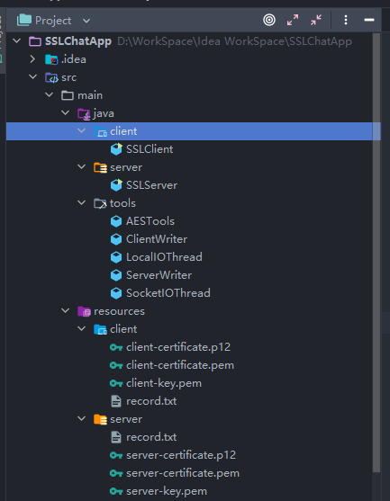
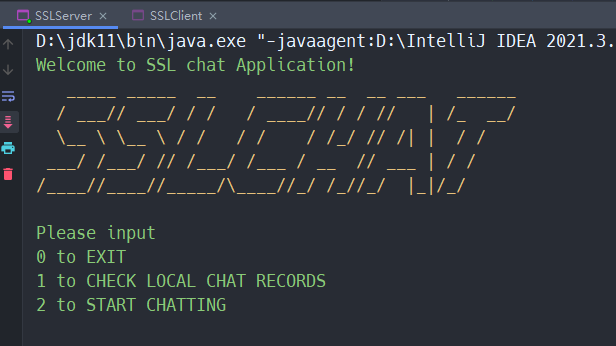
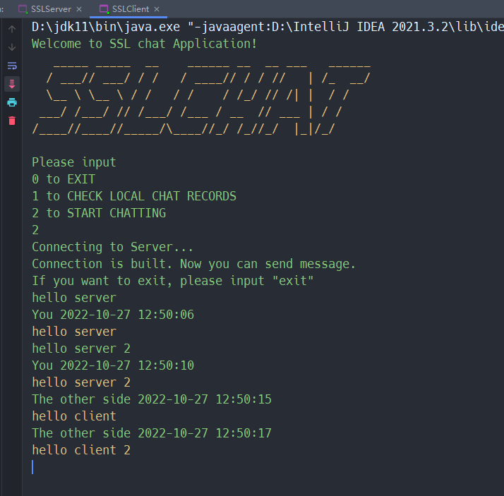
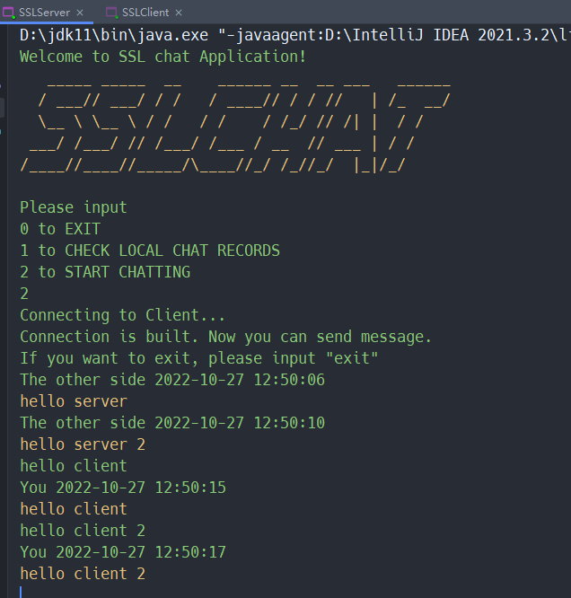
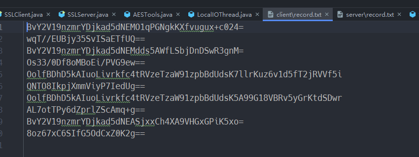
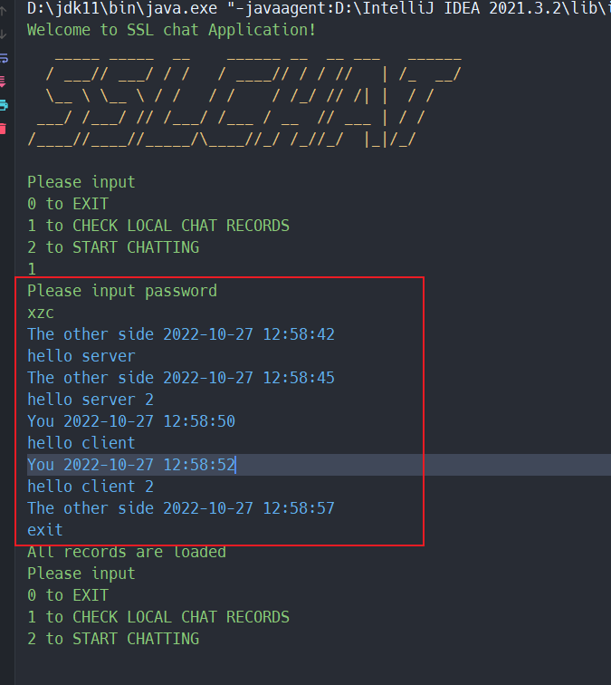
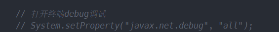
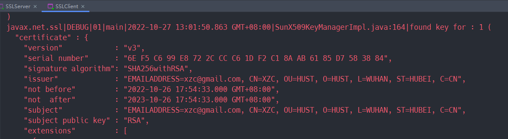
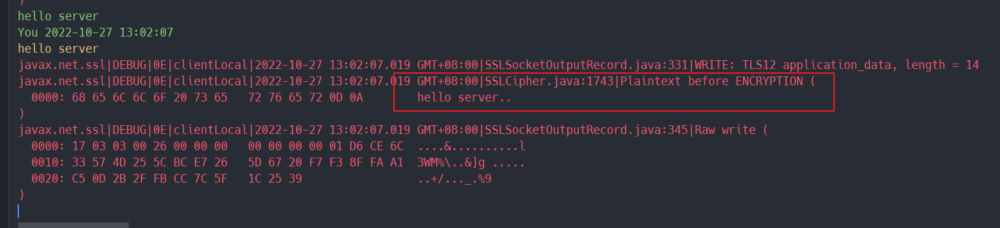
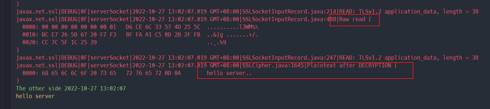

# 基于OpenSSL的安全聊天系统

## 设计要求

- Windows或Linux平台均可
- 点到点模式
- 基于OpenSSL的安全套接字通信
- 客户端服务器双向认证
- 聊天记录本地加密存储，输入正确口令可查看。

## 开发环境

- Open JDK 11.0.12
- Windows 11, Ubuntu 22.04
- IntelliJ IDEA 2021.3.2
- OpenSSL 3.0.2 

## 生成证书

先用openssl生成好证书，Windows的openssl不好用，建议先用Ubuntu下的openssl生成好，再复制到Windows。

创建时输入个人信息和地址等非重要信息，除此之外，这里建议创建的时候密码直接设为`123456`

命令：

1. 通过openssl工具为客户和服务器创建一个私钥和公共证书。

```bash
openssl req -newkey rsa:2048 -nodes -keyout client-key.pem -x509 -days 365 -out client-certificate.pem

openssl req -newkey rsa:2048 -nodes -keyout server-key.pem -x509 -days 365 -out server-certificate.pem
```

2. 将客户和服务器的私钥和公共证书分别组合成`PCKS12(P12)`格式。

```bash
openssl pkcs12 -inkey client-key.pem -in client-certificate.pem -export -out client-certificate.p12

openssl pkcs12 -inkey server-key.pem -in server-certificate.pem -export -out server-certificate.p12
```

3. 放置目录如下：

```
├─client
│      client-certificate.p12
│      client-certificate.pem
│      client-key.pem
│
└─server
        server-certificate.p12
        server-certificate.pem
        server-key.pem
```

## 文件结构



## 设计思想

- 两个进程（客户端和服务器）点到点模式，每个进程里有三个线程
- 利用OpenSSL套接字通信实现服务器和客户端双认证
- 每个进程里除主线程外还有两个线程
  - 一个线程负责不断接收对方的消息并在控制台回显（SocketIOThread）
  - 另一个线程负责不断接收控制台输入的消息并发给对方（LocalIOThread）

## 使用方法

**先根据前面的指令通过openssl生成个人证书，并放到程序目录相应位置**

程序界面：



不管是客户端还是服务器，输入0退出，输入1解密本地加密聊天记录并查看。

想通信的话，启动服务器和客户端后，**先在服务器输2，再在客户端输2，因为认证要先启动服务器**，就可以开始聊天了，想退出聊天输入`exit`回车即可。

客户端先发两条 hello server， 服务器再回两条hello client，如下





此时随意挑选服务器或客户端一方，输入exit退出即可。

根据设计要求，本地存储的聊天记录是加密的，这里采用AES加密。



在程序中刚开始的地方，输入1，再输入口令可以查看内容。**口令在AESTools的encodeRules**中修改。我们在服务器查看本地聊天记录：



如何验证双向认证和消息加密？

在`SSLClient`类和`SSLServer`类中把注释取消



，再运行程序，就能看到双向认证过程，证书信息，发送消息加密前和接收消息解密后的情况。







或者可以通过wireshark抓包查看。
